# TorrentStream Swift App - Detailed Software Engineering Report

## 1. Project Overview

TorrentStream is a mobile streaming and discovery application built with SwiftUI for iOS. The application allows a user to create an account, search torrent metadata, view detailed torrent information, save items into personal lists, share selected items with a community feed, and stream playable media directly inside the app.

The Swift project is designed as a client for the `backend-torrent-stream` service. The backend exposes REST and WebSocket APIs for authentication, torrent search, list management, community posts, and torrent streaming. The mobile app stores the authentication token locally, calls the backend with `URLSession`, and uses `AVPlayer`/`VideoPlayer` to play either a direct HTTP range stream or an HLS stream returned by the server.

This document is written as a report-ready README for the Swift app and its backend workflow. It includes architecture, workflows, diagrams, database design, run instructions, API details, and screenshots from the `archive` folder.

## 2. Repository Scope

The workspace contains three main folders:

```text
Mobile Computing/
  Torrent_stream/
    .gitignore
    swift-detailed.md
    Torrent_stream/
      Torrent_stream.xcodeproj/
      Torrent_stream/
        APIService.swift
        AppChrome.swift
        AuthViewModel.swift
        CommunityViews.swift
        ContentView.swift
        ListViews.swift
        LoginView.swift
        MainTabView.swift
        Models.swift
        OnboardingView.swift
        PlayerlistsView.swift
        PlayerView.swift
        PlaylistsView.swift
        ProfileView.swift
        SearchView.swift
        TorrentDetailView.swift
        Torrent_streamApp.swift
        Assets.xcassets/
  backend-torrent-stream/
    main.py
    auth.py
    models.py
    db.py
    database.py
    activity.py
    content_policy.py
    routes/
      search.py
      lists.py
      community.py
      stream.py
    static/index.html
    Dockerfile
    compose.yml
    requirements.txt
    .env.example
  archive/
    Simulator screenshots used in this report
```

The active Swift source files are inside:

```text
Torrent_stream/Torrent_stream/Torrent_stream/
```

The active Xcode project is:

```text
Torrent_stream/Torrent_stream/Torrent_stream.xcodeproj
```

The Xcode target includes `PlaylistsView.swift` as the active playlist implementation. The file `PlayerlistsView.swift` exists in the source folder but is not referenced by the active Xcode project file, so this report treats it as an unused legacy copy.

## 3. Problem Statement

Traditional torrent usage usually requires multiple steps: searching from a web source, opening a magnet link in another app, waiting for enough content to download, and manually organizing watched media. TorrentStream combines these steps into one mobile workflow:

- Search torrent metadata from the app.
- Inspect seeders, leechers, size, category, screenshots, and files.
- Add content to Watchlist, Watch Later, Wishlist, or Playlists.
- Share torrent recommendations in a community feed.
- Start playback directly inside the app after the backend prepares a stream.

The project therefore behaves like a mobile-first media discovery and playback system backed by a FastAPI streaming service.

## 4. Objectives

The main objectives of the project are:

- Provide a SwiftUI iOS interface for torrent discovery and playback.
- Authenticate users with email/password and JWT tokens.
- Allow user-specific organization through Watchlist, Watch Later, Wishlist, and custom Playlists.
- Support community sharing through posts, comments, tags, and voting.
- Hide the complexity of torrent preparation behind a backend streaming API.
- Use WebSocket updates so the user can see progress while the stream is being prepared.
- Use direct HTTP streaming for compatible media and HLS playback when transcoding/segmentation is useful.
- Maintain a server-side search history for recent items and trending content.
- Apply backend content filtering before saving or showing unsafe search/community text.

## 5. Technology Stack

| Layer | Technology | Purpose |
|---|---|---|
| Mobile UI | SwiftUI | Declarative iOS user interface |
| Mobile state | `ObservableObject`, `@Published`, `@StateObject`, `@AppStorage` | UI state, authentication state, app settings |
| Mobile networking | `URLSession`, `URLSessionWebSocketTask` | REST and WebSocket calls to backend |
| Mobile playback | AVKit, `AVPlayer`, `VideoPlayer` | In-app media playback |
| Backend API | FastAPI | REST and WebSocket API server |
| Backend database | MongoDB with Beanie ODM | Persistent users, torrents, lists, posts, votes |
| Auth | JWT using `python-jose`, password hashing with Passlib Argon2/Bcrypt | Secure login and protected APIs |
| Torrent engine | `python-libtorrent` | Magnet session management and torrent piece access |
| Streaming | HTTP range streaming, FFmpeg/HLS | Seekable playback and HLS playlists |
| External search | ApiBay | Torrent metadata search source |
| Deployment | Docker, Docker Compose, Uvicorn | Backend packaging and local/server running |

## 6. High-Level Architecture

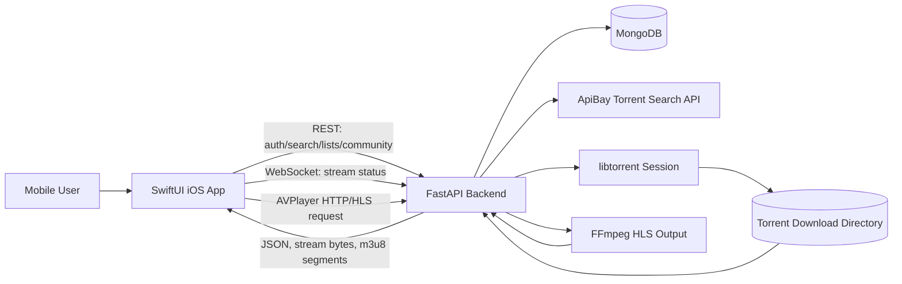

The iOS app never downloads torrent pieces directly. It only sends the magnet link and hash to the backend. The backend handles torrent metadata fetching, file selection, buffering, range streaming, HLS generation, and session cleanup.

## 7. Application Startup Workflow

The app entry point is `Torrent_streamApp.swift`.

Important startup decisions:

- `AuthViewModel` is created as a `@StateObject`.
- `hasSeenOnboarding` is stored in `@AppStorage`.
- `appTheme` is stored in `@AppStorage`.
- If onboarding has not been completed, the app opens `OnboardingView`.
- If onboarding is complete and an auth token exists, the app opens `MainTabView`.
- If onboarding is complete but no auth token exists, the app opens `LoginView`.

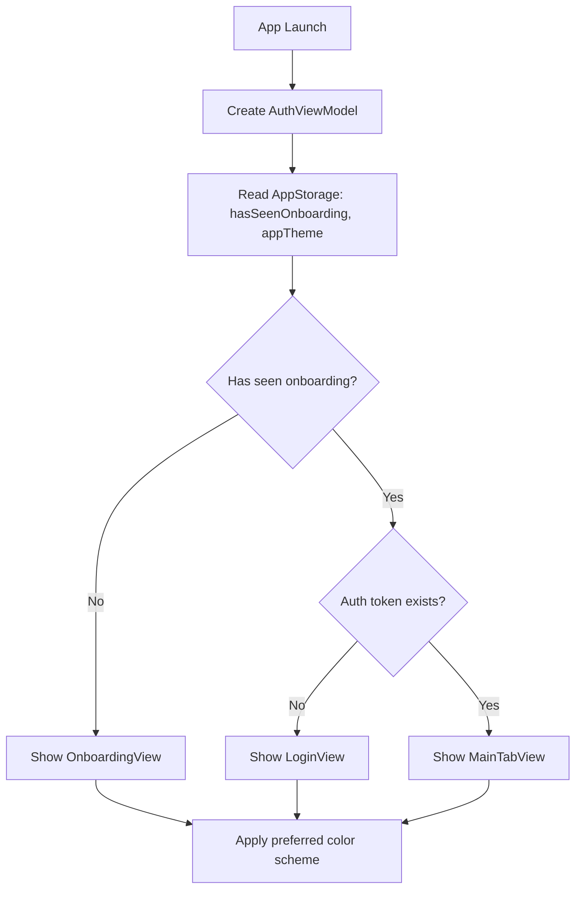

## 8. Main Navigation

The main authenticated experience is controlled by `MainTabView.swift`. It uses a `TabView` with five core tabs:

| Tab | SwiftUI view | Purpose |
|---|---|---|
| Search | `SearchView` | Search, trending, recent torrents |
| Watchlist | `WatchlistView` | Saved watchlist with watched/unwatched status |
| Watch Later | `WatchLaterView` | Queue for later viewing |
| Community | `CommunityFeedView` | Shared posts, votes, comments, tags |
| Playlists | `PlaylistsView` | Custom playlist management |

Each main screen uses shared visual styling from `AppChrome.swift`, especially `AppPalette` and `appHeader`.

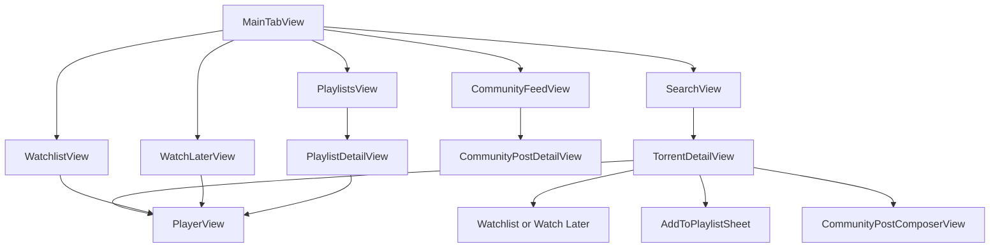

## 9. Swift App File Responsibilities

| File | Main responsibility |
|---|---|
| `Torrent_streamApp.swift` | App entry point, onboarding/login/main routing, theme application |
| `AuthViewModel.swift` | Login/register/logout state, token persistence, server URL persistence |
| `APIService.swift` | Central REST/WebSocket client and playback URL selection logic |
| `Models.swift` | Codable data models shared with backend JSON responses |
| `OnboardingView.swift` | Intro slides, theme toggle, onboarding completion |
| `LoginView.swift` | Login/register form and server configuration sheet |
| `MainTabView.swift` | Main tab layout after authentication |
| `AppChrome.swift` | Shared colors, navigation header, profile link |
| `SearchView.swift` | Search, trending, recent results, torrent cards |
| `TorrentDetailView.swift` | Torrent metadata screen, playback, list actions, community post action |
| `PlayerView.swift` | WebSocket stream preparation, AVPlayer playback, fallback handling |
| `ListViews.swift` | Reusable list UI plus Watchlist, Wishlist, Watch Later view models |
| `PlaylistsView.swift` | Playlist list, create playlist, playlist detail, play playlist items |
| `CommunityViews.swift` | Community feed, composer, post details, comments, votes, tags |
| `ProfileView.swift` | Account/profile page, theme toggle, server settings, sign out |
| `ContentView.swift` | Default starter preview view, not part of the main app routing |

## 10. Data Models in the Swift App

The Swift app defines Codable models in `Models.swift` to match backend responses.

Important model groups:

- Authentication:
  - `AuthResponse`
- Torrent search:
  - `TorrentItem`
  - `SearchResponse`
  - `TorrentPayload`
- User lists:
  - `ListItem`
  - `TorrentItemDB`
- Playlists:
  - `Playlist`
  - `PlaylistDetail`
  - `PlaylistItemEntry`
- Community:
  - `CommunityPost`
  - `CommunityPostDetail`
  - `CommunityComment`
  - `CommunityPostCreateRequest`
  - `CommunityCommentCreateRequest`
  - `CommunityVoteRequest`
  - `CommunityVoteState`
- Streaming:
  - `StreamStartResponse`
  - `StreamStatus`
  - `TorrentFilesResponse`
  - `MagnetStreamResponse`
  - `StreamSelectedVideo`
  - `StreamSubtitleTrack`
  - `StreamSocketEvent`
  - `TorrentFile`

The models also include custom decoding helpers because the backend may return some IDs as strings and some as numeric values. For example, `decodeStringValue(forKey:)` accepts `String`, `Int`, or `Int64` and converts them into a Swift `String`.

## 11. API Client Design

`APIService.swift` is the networking center of the app.

Important features:

- Default backend URL:

```text
https://torrentstream.asmsoftwares.tech
```

- User-configurable backend URL stored in `UserDefaults` under `serverURL`.
- Auth token stored in `UserDefaults` under `authToken`.
- JSON requests use `Content-Type: application/json`.
- Protected requests send:

```text
Authorization: Bearer <token>
```

- AVPlayer-compatible stream URLs include the JWT token as a query parameter because `AVPlayer` cannot reliably attach custom authorization headers to every media segment request.

`APIService` exposes methods for:

- `login`
- `register`
- `search`
- `trending`
- `recent`
- `recordSearchHit`
- Watchlist, Wishlist, Watch Later CRUD
- Playlist CRUD and playlist item CRUD
- Community posts, comments, votes
- WebSocket streaming setup
- Direct stream preparation fallback
- Playback URL selection between HLS and direct streaming

## 12. Authentication Workflow

The app supports login and registration from `LoginView`. The view calls `AuthViewModel`, which calls `APIService`, receives an `AuthResponse`, stores the token, and switches `isLoggedIn` to true.

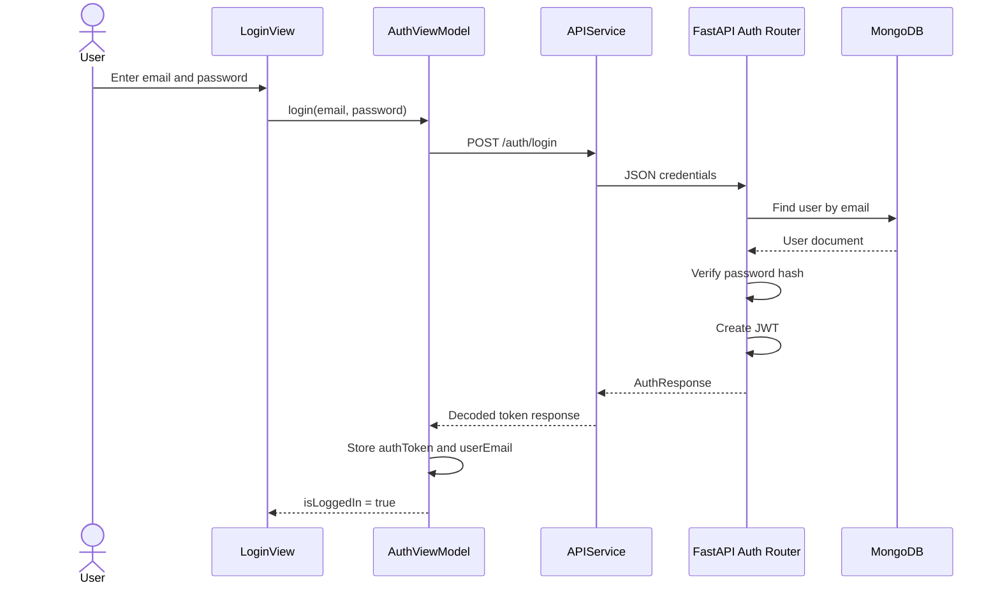

## 13. Search Workflow

`SearchViewModel` supports three modes:

- Trending
- Recent
- Search

When the user opens the Search tab, the app loads trending items by default. A manual search calls `/search/?query=<query>&category=<category>`. Selecting a result records a hit through `/search/hit`, then opens the detail sheet.

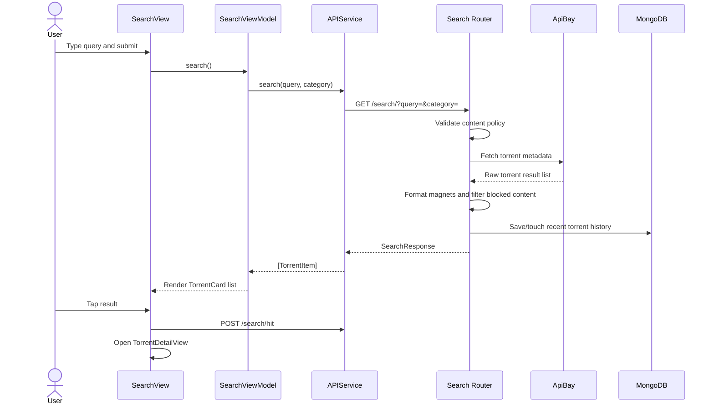

## 14. Torrent Detail Workflow

`TorrentDetailView` displays detailed information for a selected `TorrentItem`.

Displayed information:

- Poster image
- Torrent name
- Seeders and leechers
- Size
- Category
- Optional file list
- Optional screenshots returned by the search backend

Available actions:

- Play the torrent in `PlayerView`.
- Add to Watchlist.
- Add to Watch Later.
- Add to a custom Playlist.
- Create a Community post from the torrent.

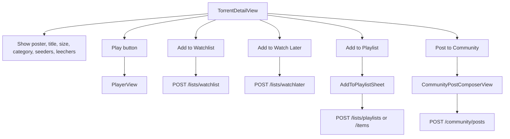

## 15. Streaming Workflow

The streaming flow is the most important technical workflow in the project.

The app tries a live WebSocket preparation flow first:

1. `PlayerView` creates `PlayerViewModel`.
2. `PlayerViewModel.start(torrent:)` opens a WebSocket to `/stream/ws?hash=<hash>&token=<jwt>`.
3. The app sends the magnet and hash as JSON.
4. The backend creates or reuses a libtorrent session.
5. The backend sends status messages with progress, peers, file readiness, and selected media metadata.
6. When enough media is ready, the backend sends a `ready` event.
7. The app selects HLS or direct playback using `APIService.playbackSelection`.
8. `AVPlayer` starts playback.
9. If the primary playback mode fails, the app tries the fallback URL.
10. If WebSocket setup fails before playback starts, the app falls back to `/stream/magnet/{hash}?magnet=<magnet>`.

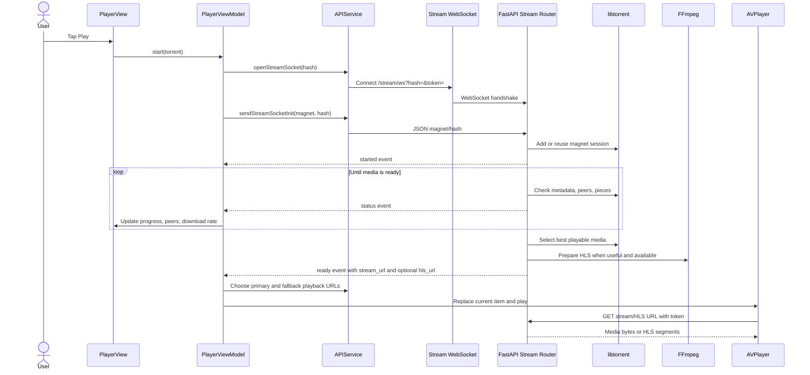

## 16. Player State Machine

`PlayerViewModel` uses a simple phase enum:

```swift
enum Phase {
    case idle
    case loading
    case playing
    case failed(String)
}
```

The model also observes `AVPlayerItem.status`, player time control changes, playback failure notifications, and playback stall notifications.

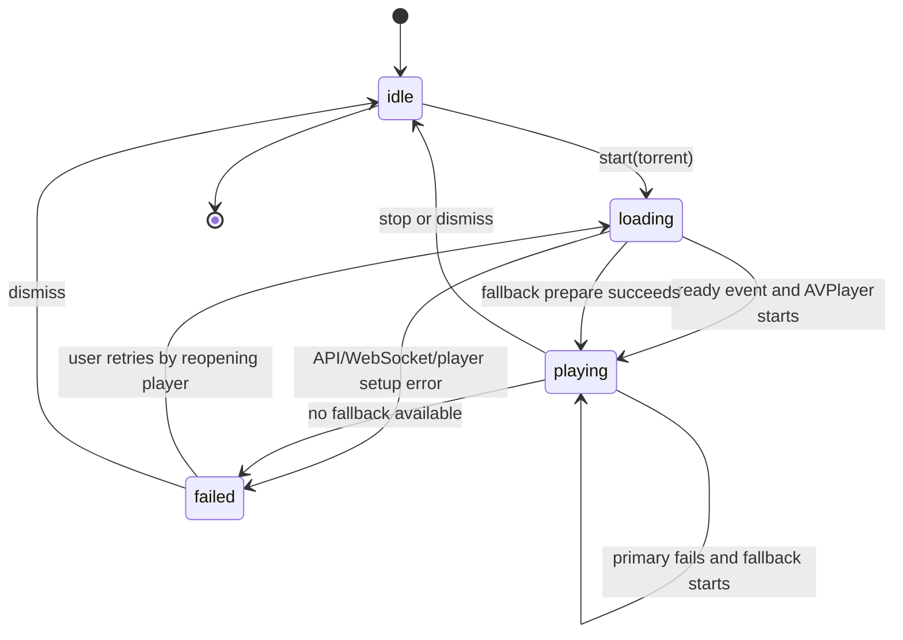

## 17. Backend Architecture

The backend is a FastAPI application declared in `main.py`.

Important backend features:

- Loads `.env` with `python-dotenv`.
- Sets up logging from `TORRENTSTREAM_LOG_LEVEL` or `LOG_LEVEL`.
- Uses `lifespan_context` from `db.py` to connect/disconnect MongoDB.
- Adds permissive CORS middleware.
- Includes routers:
  - `/auth`
  - `/lists`
  - `/community`
  - `/search`
  - `/stream`
- Serves a demo web console from `static/index.html`.
- Exposes `/health`.

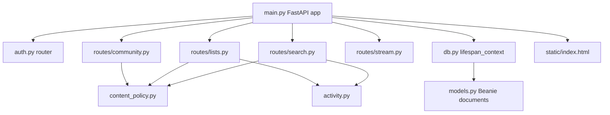

## 18. Backend Route Summary

### Auth routes

| Method | Endpoint | Purpose |
|---|---|---|
| `POST` | `/auth/register` | Create user and return JWT |
| `POST` | `/auth/login` | Verify user and return JWT |
| `GET` | `/auth/me` | Return current authenticated user |

### Search routes

| Method | Endpoint | Purpose |
|---|---|---|
| `GET` | `/search/?query=&category=` | Search external torrent API |
| `POST` | `/search/hit` | Record click/hit for trending and recent history |
| `GET` | `/search/trending?category=` | Return most-used torrents from database |
| `GET` | `/search/recent?category=` | Return current user's recent torrents |
| `GET` | `/search/top/movies` | Return top movie items |
| `GET` | `/search/top/tv` | Return top TV items |

### List routes

| Method | Endpoint | Purpose |
|---|---|---|
| `GET` | `/lists/watchlist` | Get user watchlist |
| `POST` | `/lists/watchlist` | Add torrent to watchlist |
| `PATCH` | `/lists/watchlist/{item_id}/watched` | Mark watchlist item watched/unwatched |
| `DELETE` | `/lists/watchlist/{item_id}` | Remove from watchlist |
| `GET` | `/lists/wishlist` | Get wishlist |
| `POST` | `/lists/wishlist` | Add to wishlist |
| `DELETE` | `/lists/wishlist/{item_id}` | Remove from wishlist |
| `GET` | `/lists/watchlater` | Get Watch Later list |
| `POST` | `/lists/watchlater` | Add to Watch Later |
| `DELETE` | `/lists/watchlater/{item_id}` | Remove from Watch Later |
| `GET` | `/lists/playlists` | Get playlists |
| `POST` | `/lists/playlists` | Create playlist |
| `GET` | `/lists/playlists/{playlist_id}` | Get playlist detail |
| `POST` | `/lists/playlists/{playlist_id}/items` | Add torrent to playlist |
| `DELETE` | `/lists/playlists/{playlist_id}/items/{item_id}` | Remove playlist item |
| `DELETE` | `/lists/playlists/{playlist_id}` | Delete playlist |

### Community routes

| Method | Endpoint | Purpose |
|---|---|---|
| `GET` | `/community/posts` | Get community posts, optionally by tag |
| `POST` | `/community/posts` | Create community post |
| `GET` | `/community/posts/{post_id}` | Get one community post |
| `GET` | `/community/posts/{post_id}/comments` | Get comments |
| `POST` | `/community/posts/{post_id}/comments` | Add comment |
| `PUT` | `/community/posts/{post_id}/vote` | Upvote, downvote, or clear vote |

### Stream routes

| Method | Endpoint | Purpose |
|---|---|---|
| `POST` | `/stream/start` | Start or resume torrent session |
| `GET` | `/stream/status/{hash}` | Poll torrent progress |
| `GET` | `/stream/info/{hash}` | Return selected playable media info |
| `GET` | `/stream/{hash}` | Direct HTTP range media stream |
| `GET` | `/stream/hls/{hash}/stream.m3u8` | HLS playlist |
| `GET` | `/stream/hls/{hash}/{asset_name}` | HLS segment or asset |
| `GET` | `/stream/magnet/{hash}?magnet=` | Streamlined preparation endpoint |
| `WS` | `/stream/ws/{hash}` | WebSocket stream preparation |
| `WS` | `/stream/ws?hash=` | Query-based WebSocket stream preparation |
| `DELETE` | `/stream/{hash}` | Stop torrent session and optionally delete files |

## 19. Database Design

The active backend uses MongoDB through Beanie documents in `models.py`. The older `database.py` contains SQLAlchemy/SQLite models, but `main.py` uses MongoDB through `db.py`.

Main collections:

- `db` for users
- `torrent_items`
- `recent_torrents`
- `watchlist`
- `wishlist`
- `watchlater`
- `playlists`
- `community_posts`
- `community_comments`
- `community_post_votes`

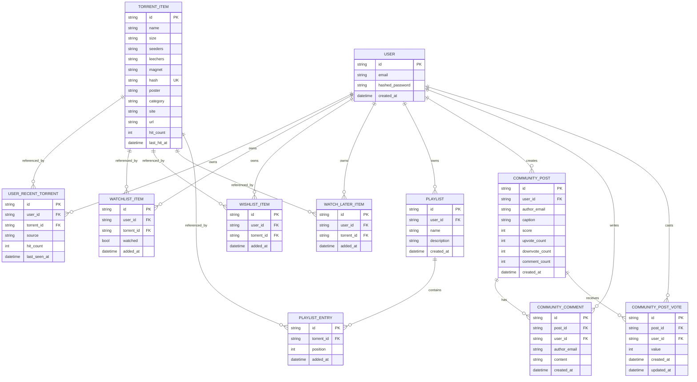

## 20. Use Case Diagram

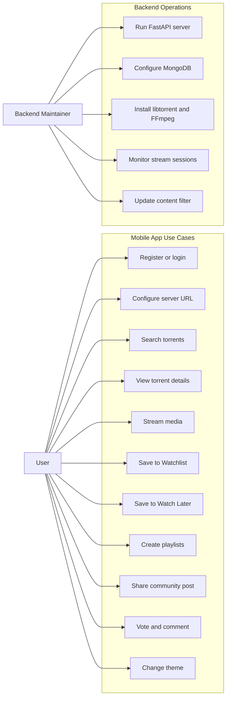

## 21. Component Diagram

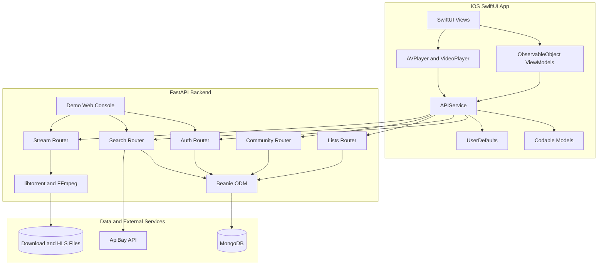

## 22. Deployment Diagram

```mermaid
flowchart LR
    subgraph Device[iPhone Simulator or iPhone]
        SwiftApp[TorrentStream iOS App]
        AVKit[AVKit Player]
    end

    subgraph Server[Backend Host]
        FastAPI[FastAPI Uvicorn App on port 8081]
        Libtorrent[libtorrent session]
        FFmpeg[ffmpeg and ffprobe]
        DownloadDir[/tmp/torrentstream or TORRENT_DOWNLOAD_DIR]
    end

    subgraph Database[Database Host]
        MongoDB[(MongoDB)]
    end

    subgraph Internet[External Network]
        ApiBay[apibay.org]
        Trackers[BitTorrent Trackers and Peers]
    end

    SwiftApp -->|HTTPS REST| FastAPI
    SwiftApp -->|WSS WebSocket| FastAPI
    AVKit -->|HTTP Range or HLS| FastAPI
    FastAPI --> MongoDB
    FastAPI --> ApiBay
    Libtorrent --> Trackers
    Libtorrent --> DownloadDir
    FFmpeg --> DownloadDir
    FastAPI --> Libtorrent
    FastAPI --> FFmpeg
```

## 23. Backend Runtime Details

### Authentication

Authentication is implemented in `auth.py`.

Key points:

- Passwords must be at least 8 characters.
- Passwords are hashed with Argon2 when available, otherwise Bcrypt.
- JWT uses the `HS256` algorithm.
- JWT expiration is controlled by `TOKEN_EXPIRE_DAYS`, defaulting to 30 days.
- Protected routes use FastAPI `HTTPBearer`.

### Search and trending

Search is implemented in `routes/search.py`.

Key points:

- External data comes from `https://apibay.org`.
- Search categories are mapped to ApiBay category codes.
- Magnet links are built from info hash and tracker URLs when needed.
- Search text is checked against the content policy.
- Returned torrent items are filtered for blocked terms/sites.
- Recent history and trending data are stored in MongoDB.
- Trending is based on server-side `hit_count`.

### Lists and playlists

List management is implemented in `routes/lists.py`.

Key points:

- Watchlist supports `watched` status.
- Wishlist exists on the backend and in reusable Swift list code, although the main tab currently exposes Watchlist, Watch Later, Community, and Playlists.
- Watch Later is separate from Watchlist.
- Playlists contain ordered `PlaylistEntry` objects.
- The backend uses `touch_torrent` to reuse torrent metadata by hash.
- Demo in-memory fallbacks exist when `LISTS_DEMO_MODE` is enabled or MongoDB operations fail.

### Community

Community features are implemented in `routes/community.py`.

Key points:

- Posts contain a caption, tags, and embedded torrent payload.
- Tags are normalized to lowercase.
- Maximum tags: 5.
- Maximum tag length: 24 characters.
- Posts are sorted by score and creation time.
- Users can upvote, downvote, or clear their vote.
- Comment count is stored on the post and updated when comments are added.

### Streaming

Streaming is implemented in `routes/stream.py`.

Key points:

- Uses `python-libtorrent` to create and manage torrent sessions.
- Stores active sessions in memory by torrent hash.
- Stores downloads under `TORRENT_DOWNLOAD_DIR`, defaulting to `/tmp/torrentstream`.
- Supports playable video and audio extensions.
- Selects the best playable media file by extension and size.
- Scans subtitle files.
- Supports direct HTTP range streaming for seekable playback.
- Supports HLS playlist/asset routes using FFmpeg.
- Prioritizes torrent pieces around the playback range.
- Uses a background reaper thread to clean inactive sessions.
- Supports token query authentication for AVPlayer/HLS compatibility.

## 24. Content Policy

The backend includes `content_policy.py`, which blocks unsafe or unwanted terms from:

- Search queries
- Torrent metadata
- Community captions
- Community tags
- Comments

The policy uses default keyword lists and loads additional keywords from `nsfw_list.txt`.

In the Swift app, `SearchViewModel` maps backend blocked-content errors into a friendly user message:

```text
That search is blocked by the server safety filter.
```

## 25. Non-Functional Requirements

| Requirement | Implementation |
|---|---|
| Usability | SwiftUI tabs, cards, action buttons, onboarding, server configuration |
| Responsiveness | Async/await networking and progress UI |
| Security | JWT auth, protected routes, password hashing |
| Persistence | MongoDB backend and UserDefaults for local token/settings |
| Stream readiness | WebSocket status updates before AVPlayer starts |
| Playback compatibility | HLS and direct stream fallback selection |
| Maintainability | Clear separation of Swift views, models, API client, and backend routers |
| Scalability | Backend stores shared torrent metadata once by hash and records hit counts |
| Safety | Content policy blocks configured terms and sites |

## 26. How to Run the Backend

The backend needs MongoDB, libtorrent, and FFmpeg for full functionality.

### Option A: Run with Docker

From the backend folder:

```powershell
cd "e:\3_2\project\Mobile Computing\backend-torrent-stream"
Copy-Item .env.example .env
docker compose up --build
```

The compose file exposes:

```text
8081:8081
6881-6891/tcp
6881-6891/udp
```

Important note: `compose.yml` only defines the web service. MongoDB must be available separately, and `MONGODB_URL` in `.env` must point to a reachable MongoDB instance.

### Option B: Run locally with Python

From the backend folder:

```powershell
cd "e:\3_2\project\Mobile Computing\backend-torrent-stream"
Copy-Item .env.example .env
python -m venv .venv
.\.venv\Scripts\Activate.ps1
pip install -r requirements.txt
python main.py
```

The backend defaults to:

```text
http://127.0.0.1:8081
```

The health check is:

```text
GET http://127.0.0.1:8081/health
```

### Backend environment variables

| Variable | Default | Purpose |
|---|---|---|
| `MONGODB_URL` | `mongodb://localhost:27017` | MongoDB server URL |
| `MONGODB_DB` | `torrentstream` | MongoDB database name |
| `JWT_SECRET` | Development placeholder | Secret used to sign JWTs |
| `TOKEN_EXPIRE_DAYS` | `30` | JWT lifetime |
| `PORT` | `8081` | Uvicorn server port |
| `TORRENT_DOWNLOAD_DIR` | `/tmp/torrentstream` | Torrent and HLS file storage |
| `STREAM_PREPARE_TIMEOUT` | `25` | Initial magnet preparation timeout |
| `STREAM_METADATA_TIMEOUT` | `180` | Metadata wait timeout |
| `STREAM_FILE_WAIT_TIMEOUT` | `120` | File range readiness timeout |
| `STREAM_CHUNK_SIZE` | `32768` | HTTP stream chunk size |
| `LISTS_DEMO_MODE` | `false` | Enables in-memory list storage fallback |

## 27. How to Run the iOS App

From macOS with Xcode installed:

1. Open the Xcode project:

```text
Torrent_stream/Torrent_stream/Torrent_stream.xcodeproj
```

2. Select an iOS simulator, for example iPhone 14 Pro.

3. Build and run the app.

4. Complete onboarding.

5. On the login screen, either use the default server or tap `Configure Server`.

6. For local backend testing, set the server URL to the backend address reachable from the simulator. Example:

```text
http://127.0.0.1:8081
```

7. Register or login.

8. Use the Search tab, open a torrent detail page, and tap Play.

## 28. End-to-End Runtime Flow

This is the complete practical workflow from app launch to playback:

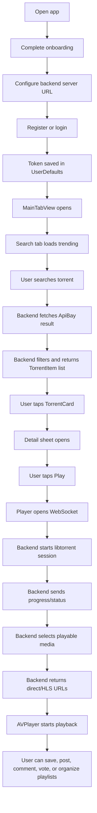

## 29. Error Handling and Fallbacks

The project includes several fallback paths:

- If the user is not authenticated, API requests fail with `APIError.noToken`.
- If backend returns a non-2xx response, `APIService` throws `APIError.httpError`.
- If JSON decoding fails, `APIService` throws `APIError.decodingError`.
- If the WebSocket stream fails before playback, `PlayerViewModel` calls `prepareStream`.
- If the primary playback URL fails, `PlayerViewModel` tries the fallback URL.
- If content is blocked by the backend policy, the search UI shows a clear blocked-content message.
- If MongoDB operations fail in some list routes, backend demo fallback structures may be used.
- If HLS tools are missing, the backend can still serve direct streams when possible.

## 30. Security Considerations

Security-related design choices:

- Passwords are never stored in plaintext.
- JWTs protect API routes.
- The Swift app stores the JWT in `UserDefaults`. For production, Keychain would be stronger.
- AVPlayer stream URLs include a token query parameter because media requests need authorization.
- The server validates token query parameters for direct stream and HLS routes.
- Search, community text, and torrent metadata are filtered by backend content policy.
- The backend CORS policy is currently permissive. For production, allowed origins should be restricted.
- `JWT_SECRET` must be changed before production deployment.

## 31. Limitations

Current limitations visible from the codebase:

- The Swift app stores tokens in `UserDefaults` instead of Keychain.
- The main tab does not expose Wishlist, although reusable wishlist code exists.
- `PlayerlistsView.swift` appears to be an unused older playlist implementation.
- `ContentView.swift` is still the default starter view and is not part of the main app flow.
- `database.py` contains old SQLite models, but runtime uses MongoDB through `db.py`.
- Docker Compose does not include a MongoDB service.
- Streaming quality depends on torrent health, seeders, peers, and server resources.
- Some torrent formats may require HLS fallback or may fail if AVPlayer cannot decode them.
- The archive includes one older screenshot unrelated to TorrentStream; it is included in the gallery because it exists in the requested screenshot folder.

## 32. Future Improvements

Recommended improvements:

- Store auth token in iOS Keychain.
- Add a Wishlist tab or expose Wishlist through Profile/Browse consistently.
- Remove unused legacy files after confirming they are no longer needed.
- Add unit tests for `APIService.playbackSelection`.
- Add UI tests for onboarding, login, search, detail, and list workflows.
- Add backend tests for auth, content policy, lists, community votes, and stream URL authorization.
- Add a MongoDB service to `compose.yml`.
- Add better stream session observability, such as admin metrics for active torrents and HLS sessions.
- Add a refresh-token flow or shorter-lived stream tokens.
- Improve accessibility labels on custom UI controls.
- Add privacy and legal usage notices inside onboarding or settings.

## 33. Screenshot Gallery

The following screenshots come from the `archive` folder. The `__MACOSX` files are metadata artifacts and are not included as app screenshots.

| Screenshot | Description |
|---|---|
|  | Archived simulator image: an older `Add Inmate` form screen. This appears unrelated to TorrentStream but is included because it exists in the archive folder. |
|  | Onboarding slide 1: `Search Torrents`, introducing search and torrent metadata discovery. |
|  | Onboarding slide 2: `Stream Instantly`, explaining in-app progressive torrent streaming. |
|  | Onboarding slide 3: `Build Your Lists`, introducing Watchlist, Wishlist, Watch Later, and Playlists. |
|  | Onboarding slide 4: `Join the Community`, introducing posting, voting, and comments. |
|  | Login screen with email/password fields and server configuration access. |
|  | Register screen for creating a new account. |
|  | Server Configuration sheet where the backend URL can be changed. |
|  | Search tab showing Trending mode and bottom navigation. |
|  | Search tab showing Recent mode and personal history. |
|  | Search results after entering a query, with category filter and torrent cards. |
|  | Torrent detail screen with metadata and action bar for Play, Watch, Later, and Playlist. |
|  | Player loading screen showing torrent session preparation, progress, peers, and download rate. |
|  | Active player view with video playback, selected media name, playback mode, and subtitle status. |
|  | Add to Playlist sheet showing existing playlist selection and create-new-playlist form. |
|  | Post to Community composer with selected torrent, caption editor, and tag input. |
|  | Community feed with search, posts, tags, vote buttons, comments, and score. |
|  | Community post detail screen with votes, caption, comments, and comment composer. |
|  | Watchlist screen showing saved items and watched status. |
|  | Watch Later screen showing queued items. |
|  | Playlists tab showing custom playlists and item counts. |
|  | Playlist detail screen with Play All and individual playlist items. |
|  | Profile screen in dark theme with browse shortcuts, theme toggle, server settings, and sign out. |
|  | Profile screen in light theme after switching from dark mode. |

## 34. Screenshot-to-Feature Mapping

| Feature | Related screenshots |
|---|---|
| Onboarding | 14.13.23, 14.13.29, 14.13.35, 14.13.42 |
| Authentication | 14.14.22, 14.14.33 |
| Server configuration | 14.14.55 |
| Search and discovery | 14.15.17, 14.15.26, 14.16.19 |
| Detail and playback | 14.17.04, 14.17.16, 14.19.13 |
| Playlists | 14.20.14, 14.21.06, 14.21.10 |
| Community | 14.20.31, 14.20.45, 14.20.51 |
| Watchlist and Watch Later | 14.20.57, 14.21.02 |
| Profile and theme | 14.21.15, 14.21.24 |

## 35. Testing Strategy

Recommended testing plan:

### Swift app testing

- Test onboarding completion and persistence.
- Test theme toggle persistence.
- Test login and register error states.
- Test server URL normalization.
- Test search empty state, loading state, blocked-content state, and result state.
- Test tapping a result opens `TorrentDetailView`.
- Test adding to Watchlist and Watch Later.
- Test creating playlists and adding torrents to playlists.
- Test community post creation, vote toggling, and comment submission.
- Test player state transitions from loading to playing and failed.
- Test HLS fallback and direct fallback URL selection.

### Backend testing

- Test `/health`.
- Test register/login/me.
- Test password minimum length.
- Test content policy blocking for search, captions, tags, comments, and torrent payloads.
- Test search response shape.
- Test `/search/hit` increments hit count and recent history.
- Test each list CRUD route.
- Test playlist item ordering and deletion.
- Test community vote changes from upvote to downvote to cleared vote.
- Test stream route authorization with Bearer token and query token.
- Test stream session cleanup after idle timeout.

## 36. Legal and Ethical Note

TorrentStream is a technical project that demonstrates search, organization, and streaming workflows. Torrent technology can be used for legal and illegal distribution depending on the content. The app should only be used with content that the user has the legal right to access, download, or stream.

## 37. Conclusion

TorrentStream is a complete SwiftUI mobile app connected to a substantial FastAPI backend. The Swift app focuses on a clean user workflow: onboarding, authentication, search, detail view, list organization, community interaction, and in-app playback. The backend handles the complex parts: authentication, persistence, content filtering, external torrent search, torrent session management, WebSocket progress, direct HTTP range streaming, and HLS playback support.

The project is suitable for a software engineering report because it includes clear client-server separation, persistent data modeling, authentication, multiple user workflows, real-time communication, media streaming, and enough architectural complexity to justify system, component, sequence, state, deployment, and ER diagrams.
